# Samadhi EEG / LSL

_Samadhi EEG_ is a project to build a Python/Qt/OpenGL based application
for visualising EEG and spectrum data in novel ways. Hooking onto an LSL stream, the software monitors
and displays EEG at realtime. The project has just started, implementation is not
mature yet and the content is mainly experimental. 

### Data

#### Sources: LSL and Simulation

Data is received from an
* **LSL stream** which can be selected from a dropdown box on the left. In addition there is a
* **selftest** with five channels which runs through combinations of single frequencies so you can check the behaviour
of spetrum displays.

#### Processing: Mean, Variance, PSD and Normalisation

Data is received from the stream in chunks of 200 ms. The
* **PSD** is calculated over the last two seconds (square of the norm of the FFT result) and normalised by the smoothed PSD history. This
* **PSD history** is calculated from the PSD mean over the channels, and updated every 200 ms by: *new PSD = 0.99 \* old PSD + 0.01 \* raw PSD.* The
* **relative band power** is the mean over all channels, integrated per frequency band (excluding DC), divided by the spectrum band width to prevent wider bands having more influence, then normalised so the sum of all bands is 1.0. In parallel, the provided
* **relative variance** is the variance over the last two seconds of EEG data, divided by the mean variance over all channels (such that the expected variance per channel is 1.0).

### Display: Dancing Dots

**A wavy, rotating, jelly-fish like flower made up of single dots.** This is a spectrum display, visualising the current value of the EEG frequency bands Delta, Theta, Alpha, Beta and Gamma.
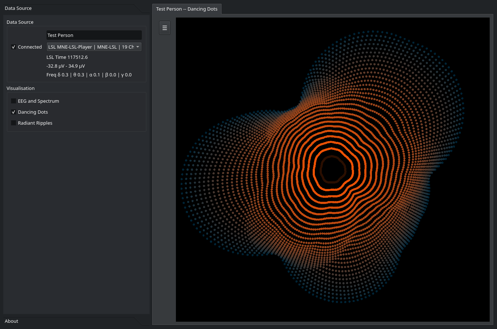
The data from the spectrum analysis is averaged over rings of different lengths, arranged in concentric circles. The hills and valleys of the sine waves add up or cancel out, depending on their frequency and the circumference of the circle, creating a flower-like pattern with different colours and rotations.
This means the frequency of the spectrum band is represented in the symmetry of the dot display:

|                               Delta                               |                              Theta                               |                              Alpha                               |                              Beta                               |                              Gamma                               |
|:-----------------------------------------------------------------:|:----------------------------------------------------------------:|:----------------------------------------------------------------:|:---------------------------------------------------------------:|:----------------------------------------------------------------:|
| 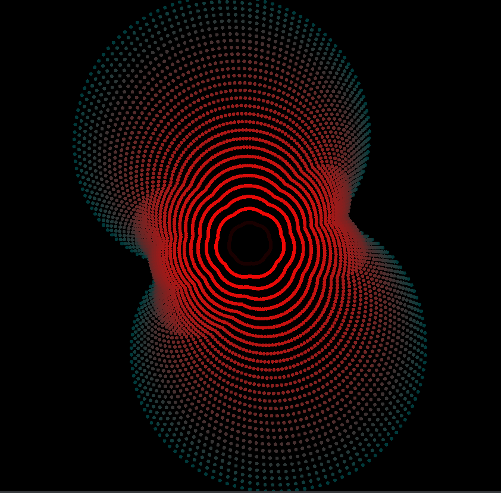  | 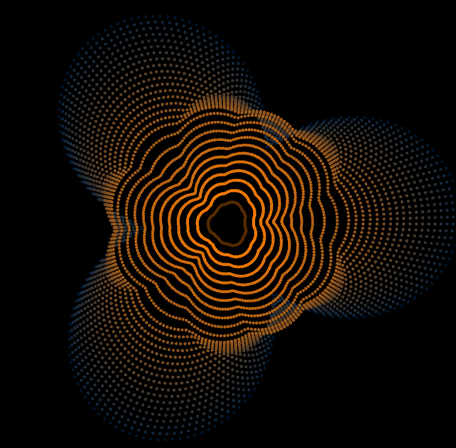 | 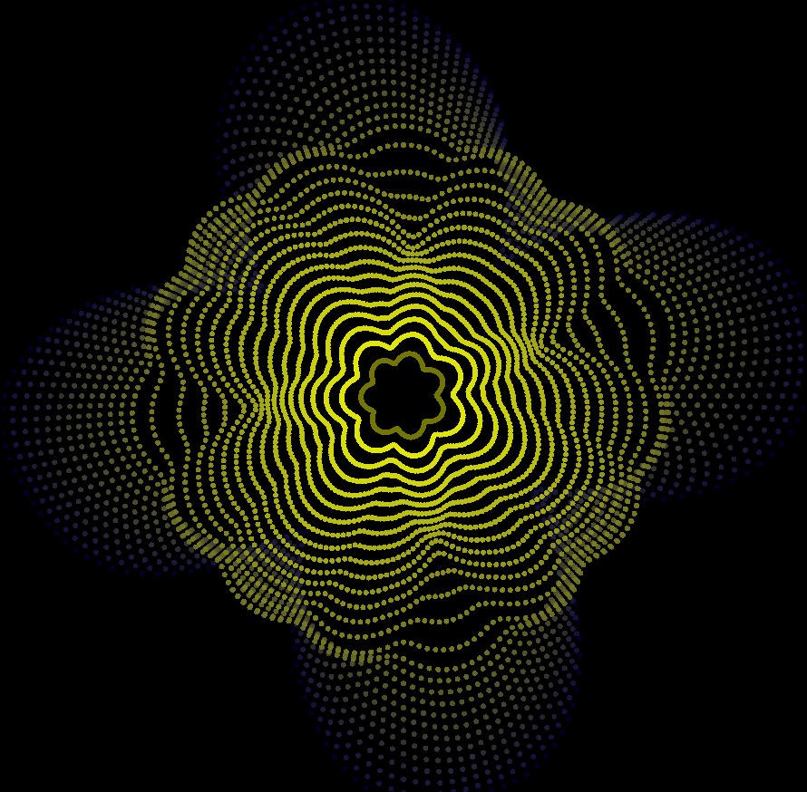 | 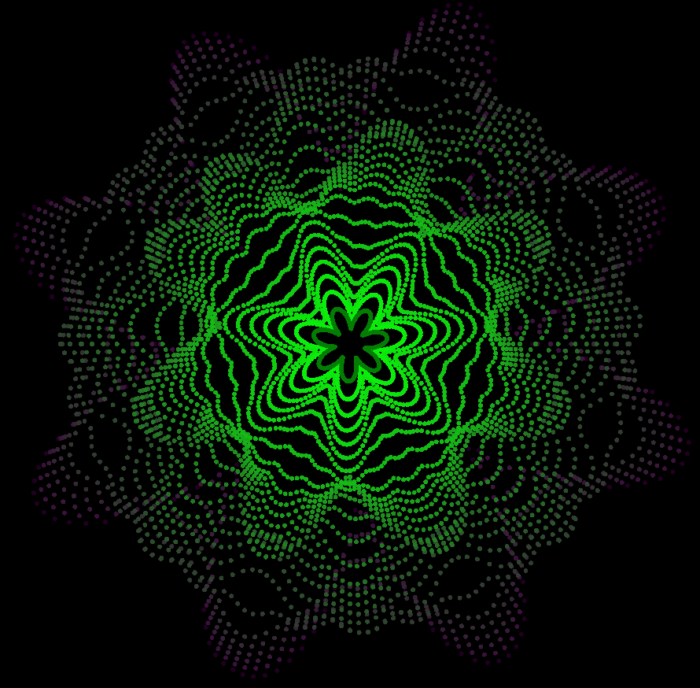 | 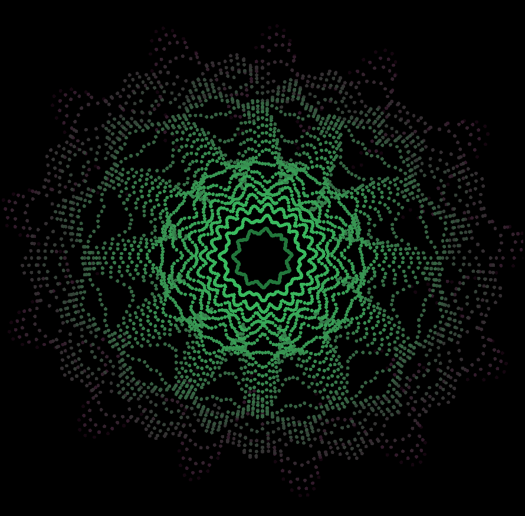 |

The actual display will be a superposition of these. The dancing dot flower display runs first inside
the window, a mouse click brings it to full-screen
(and back again). This display uses hardware acceleration (OpenGL).

### Display: Radiant Ripples

**A topological 2D-display showing activities like ripples on a pond.** When displaying time series data from spacial sources, there's a trade-off between showing a map but only the current moment (like in voltage mappings), or showing the history but not the spacial layout (like in a curve display). This is a topological display, visualising relative variance per channel by constantly expanding ripples of different frequency.
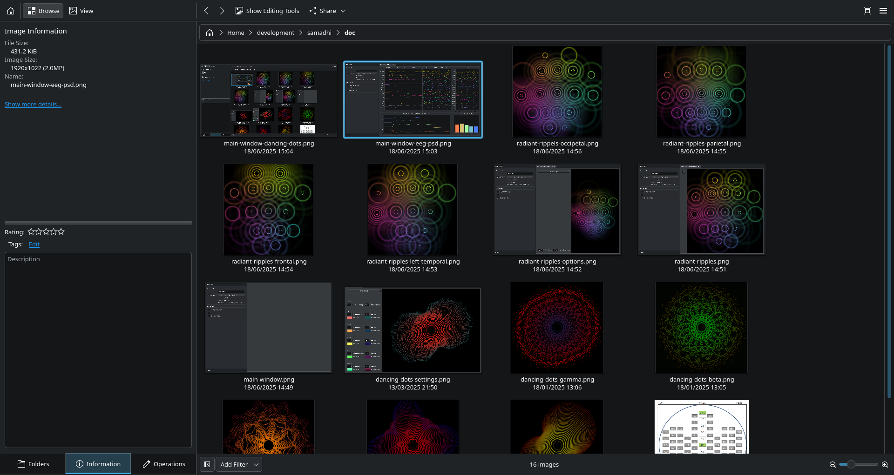
High-variance channels will produce many ripples, low variance channels few, or none. The ripples are colour-coded with a nautical colour scheme (starboard — green, portside — red, bow — yellow, stern — blue).

|                               Frontal                              |                                  Left Temporal                                 |                              Occipetal                                 |                              Parietal                                 |
|:------------------------------------------------------------------:|:------------------------------------------------------------------------------:|:----------------------------------------------------------------------:|:---------------------------------------------------------------------:|
| 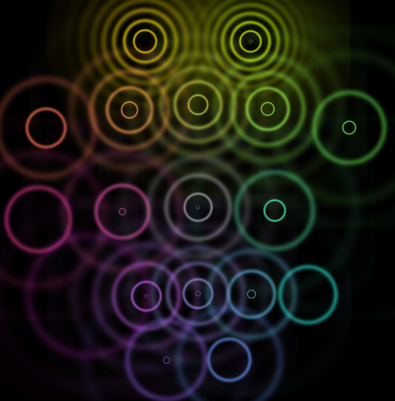 | 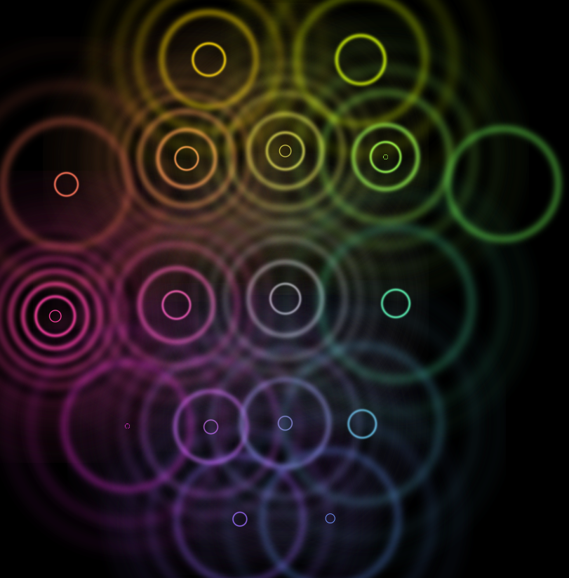 | 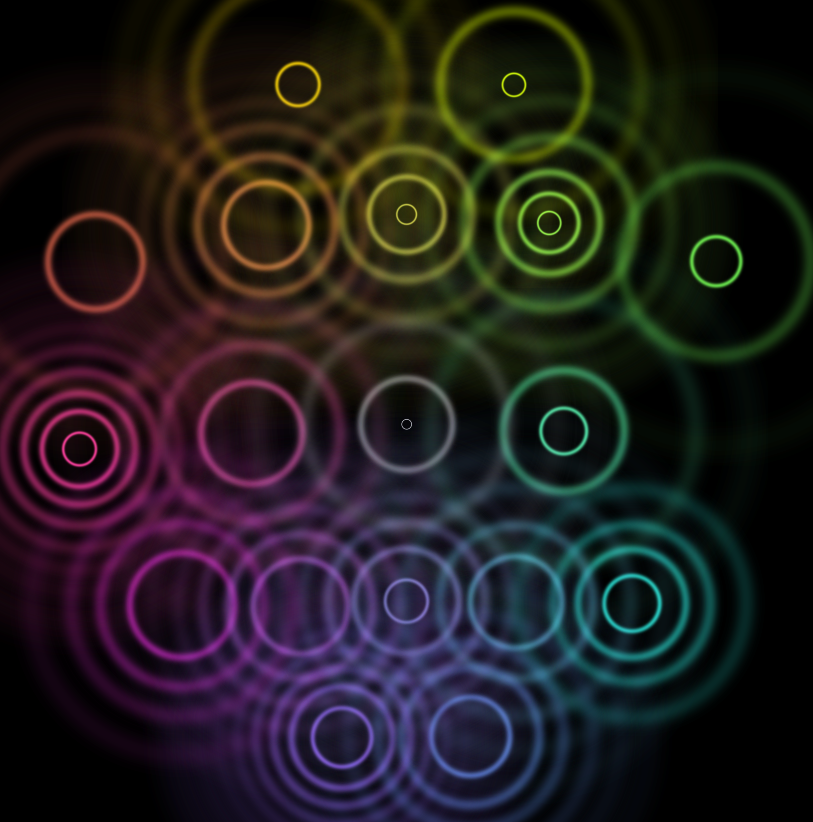 | 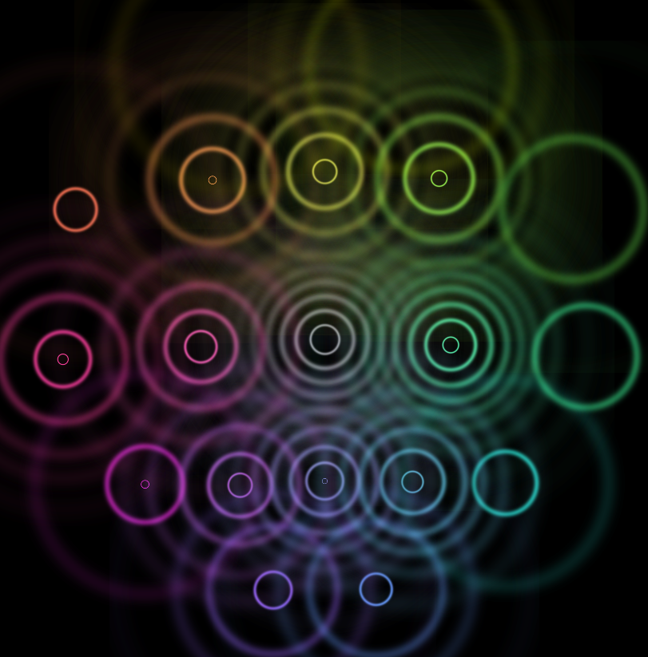  |

This display uses hardware acceleration (OpenGL).

### Display: Standard EEG and Spectrum

**Standard plots showing EEG and Spectrum.** The data is shown as received via LSL, a spectrum view (averaged power spectrum in log view), a history of the last 10 minutes of spectrum, and the current spectrum as a bar plot.
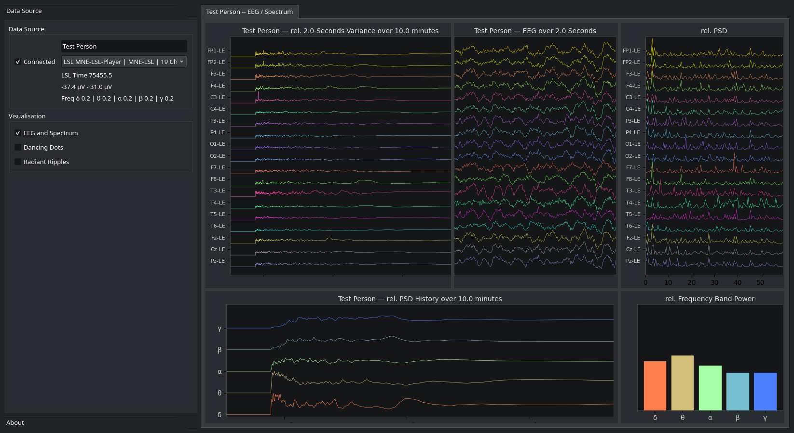
The spectrum values are obtained from a Fourier Transform (power spectral density), 

### Installing and Running

The software is a python package on PyPi. To install and run, do:
`pip install samadhi`
`python3 -m samadhi`
To uninstall:
`pip uninstall samadhi`
(Non-Python installers for Linux and Windows will follow)
