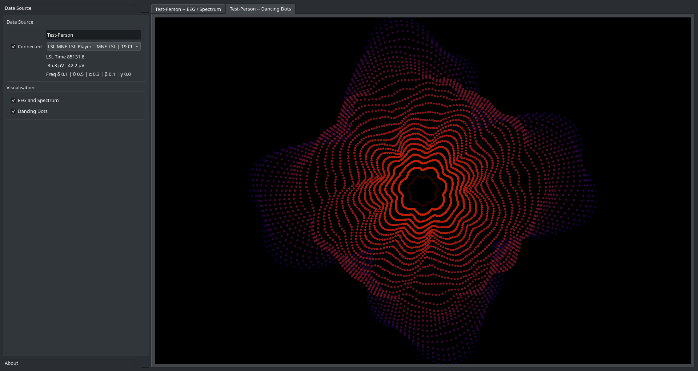

# Samadhi EEG / LSL

_Samadhi EEG_ is a project to build a Python/Qt/OpenGL based application
to visualise EEG and spectrum data in novel ways. The project has just started, implementation is not
mature yet and the content is mainly experimental. Data is received via LSL streams (and possible
later in the project by other means).

### EEG/Spectrum Display

**Standard plots showing EEG and Spectrum.** The data is shown as received via LSL, a spectrum view (averaged power spectrum in log view),
a history of the last 10 minutes of spectrum, and the current spectrum as a bar plot.

The spectrum values are obtained from a Fourier Transform (power spectral density), divided by the spectrum
band width to prevent wider bands having more influence, and then normalised so the sum of all bands 
is 1.0.

### Dancing Dots

**A wavy, rotating, jelly-fish like flower made up of single dots.** This is a spectrum display, visualising
the current value of the EEG frequency bands Delta, Theta, Alpha, Beta and Gamma. The data
from the spectrum analysis is averaged over rings of different lengths, arranged in concentric circles. The
hills and valleys of the sine waves add up or cancel out, depending on their frequency and the circumference
of the circle, creating a flower-like pattern with different colours and rotations.

The dancing dot flower display runs first inside the window, a mouse click brings it to full-screen
(and back again). This display uses hardware acceleration (OpenGL).